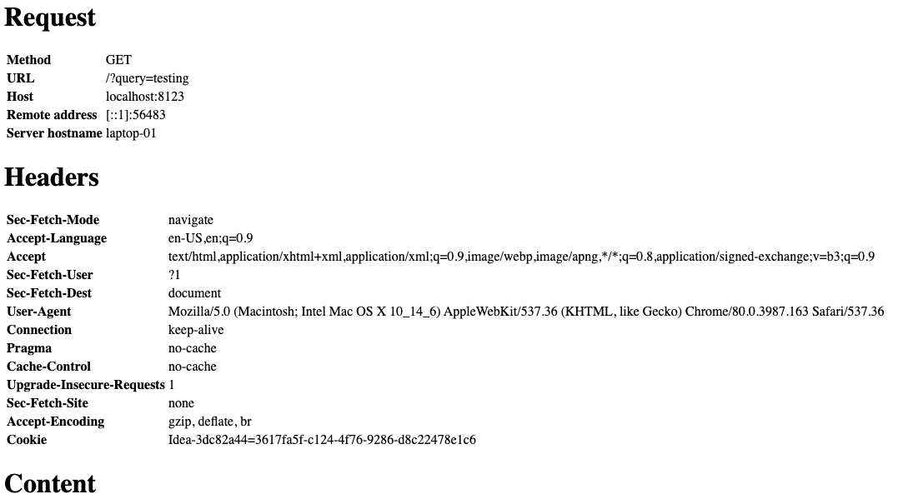

[](https://hub.docker.com/r/itzg/web-debug-server)
[](https://app.circleci.com/pipelines/github/itzg/web-debug-server)

# web-debug-server

A very minimal web server that responds with a page containing the request headers and content

## Usage

```
  -bind host:port
        The host:port to bind, but using port flag is preferred (env BIND)
  -port int
        The port to bind (env PORT) (default 8080)
  -redirects path=location
        Declares path=location mapping of local path to a resulting 307 redirect location (env REDIRECTS)
  -response-fixed-body string
        When set, specifies a fixed body to write to the response (env RESPONSE_FIXED_BODY)
  -response-fixed-content-type string
        When FixedBody is set, specifies the content type to set (env RESPONSE_FIXED_CONTENT_TYPE) (default "text/plain")
  -response-headers value
        List of header:value pairs to include in response (env RESPONSE_HEADERS)
  -response-status int
        When set, specifies the status code to use in responses (env RESPONSE_STATUS) (default 200)
```

## Examples

If the server is started with `--port 8123`, then accessing [http://localhost:8123?query=testing](http://localhost:8123?query=testing) from a browser would render:



If the server is also given `--redirects /redirect=/`, then accessing [http://localhost:8123/redirect](http://localhost:8123/redirect) would redirect the browser to [http://localhost:8123/](http://localhost:8123/).